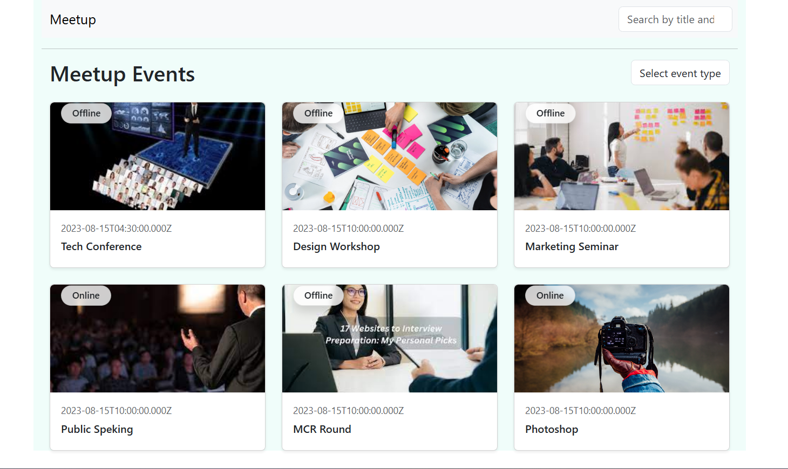

# 🧾 PRD: MERN Meetup Application
## 🎯 Objective

To build a full-stack Meetup Management Application using the MERN stack that allows users to create, view, and filter event details efficiently.

## 🧩 Backend Overview

- Initialized backend using npm init -y and installed Express, CORS, and Mongoose.
- Configured database connectivity and created Event Schema with fields:
`title, organizer, type, venue, speakers, description, and tags`.
- Implemented Core APIs using async/await and try-catch for error handling:

  - POST /events – Store new event details.
  - GET /eventList – Fetch all events.
  - GET /events/title/:titleName – Search events by title using regex ($regex: new RegExp(title, 'i')).
  - GET /events/:eventMode – Filter events by type (Online/Offline).
  - GET /event/tag/:tagName – Retrieve events by tags.
  - GET /events/:id – Fetch individual event details by ID.

Backend hosted on Vercel.
🔗 Source Code: GitHub - [MERNMeetupServer](https://github.com/Sourabhpande532/MERNMeetupServer)

*** 

## 💻 Frontend Overview

- Built using React JS; integrated all backend APIs for dynamic data display.
- Created reusable components: Header.jsx, Layout.jsx, MeetupEvents.jsx, DetailsEvent.jsx.
Implemented key features:

  - Fetch and list all events from the database.
  - Search by title and filter by type (Online/Offline).
  - View event details on a separate page using React Router.
  - Managed state and data flow with useState, props, and custom hooks.

Frontend hosted on Vercel.
🔗 Source Code: GitHub - [MERNMeetupClient](https://github.com/Sourabhpande532/MERNMeetupClient)

## Key Learning: 
   - How to share data using props,manage routing
   - key understanding of child parent concept

---
Project Images:

---

--- 